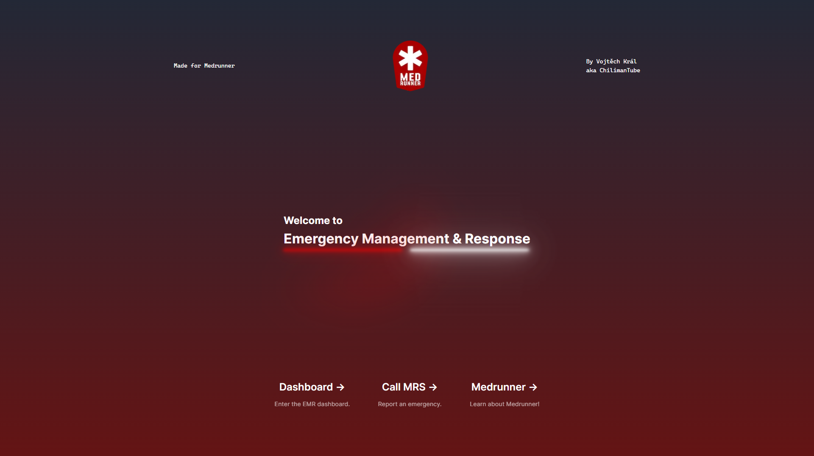
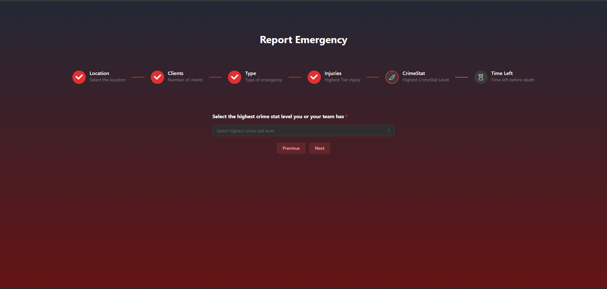
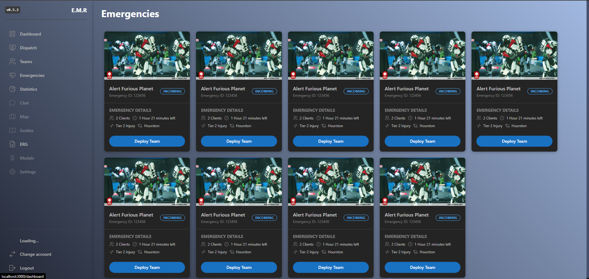

# E.M.R - Emergency Management and Response
## Made for [Medrunner](https://medrunner.space)
## Development notes
### Libraries:

- [React](https://react.dev)
- [Mantine](https://mantine.dev/)
- [Next.js](https://nextjs.org)
- [Flask](https://flask.palletsprojects.com)
- [SQLAlchemy](https://www.sqlalchemy.org/)
- [Node.js](https://nodejs.org/en/)
- [PostCSS](https://postcss.org/)
- [PostgreSQL](https://www.postgresql.org/)
### How to run:
1. Download Docker Desktop
2. In the `/apps/web/emr/` run the following command:
    ```bash
    npm i
    ```
    Note: If you're encountering any missing dependencies errors, try running `npm i` in the **root** of the project
3. Make sure to install any python dependencies in the `/apps/backend/` using **pip** or any other method
4. Run the following command in the __root__ of the folder using VSCode:
    ```bash
    docker-compose up
    ```
    After that run the containers if they didn't start automatically

5. In the `/apps/backend` run the following commands if you're having troubles with the database (login / registration aren't working and so on)
    ```bash
    flask db init
    flask db migrate
    flask db upgrade
    ```
    If you're getting an error that migrations folder isn't empty, delete all migrations there (all files in the `/backend/migrations/`) and try again

6. In the __root__ of the project run the following code:
    ```bash
    npm run dev
    ```
    This will start the front-end of the project on your `localhost:3000`
7. In `/apps/backend` run the `app.py` either using **IDE** or by the following command:
    ```bash
    python app.py
    ```
8. Now the project should be ready and you can view it on `localhost:3000` in your browser

## Gallery:
### Landing Page

### Emergency Report

### Team Deployment


